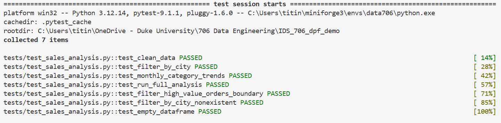
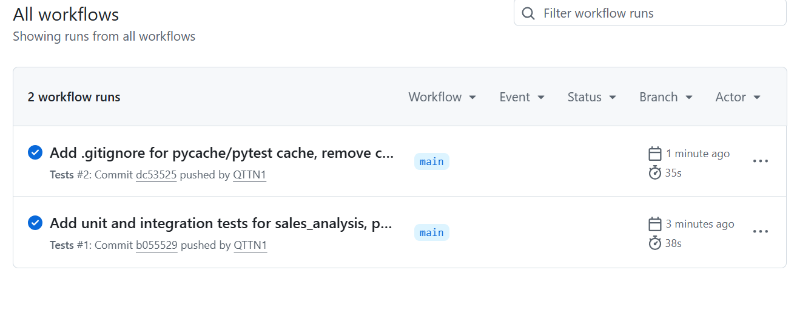

[](https://github.com/QTTN1/IDS_706_dpf_demo/actions/workflows/tests.yml)

My data engineering project using pandas to explore a sales dataset from Kaggle.

## Setup

```
pip install -r requirements.txt
```

(Python 3.12. I use a conda env, but any environment works as long as `requirements.txt` is installed.)

Then open `Week2_Mini_Assignment.ipynb` and run all the cells -- it downloads the dataset automatically with kagglehub, so no manual download needed. (To run the tests instead, see the Testing & CI section below.)

## Dataset

[Sales Dataset (E-Commerce Sales)](https://www.kaggle.com/datasets/naofilahmad/sales-datset-product-sample) from Kaggle. ~186k orders, 8 product categories, 9 cities, 1 year (12 months) of data.

## What I did

**Import + Inspect**

Loaded the CSV with pandas, used `.head()`, `.info()`, `.describe()` to investigate, checked for missing values/duplicates (there weren't any). Dropped an extra blank column, and transformed Order Date to an actual date.

**Filtering + Grouping**

Additional dataset investigation, and setup for the ML algorithm.

I filtered things like high-value orders (Sales > $500) and orders from specific cities. Used `groupby()` to get avg price/total sales per category, and avg sale amount by time of day, and total sale by month.

**ML - Linear Regression**

Grouped sales by month per category, then fit a linear regression (Sales ~ Month) per category to see which ones are trending up. I also did the same for order count and average order value, since a category could be growing in orders without growing much in revenue, or vice versa.

Results: every category trended up overall, and followed a similar monthly trend. Laptops and Computers had the strongest revenue trend, and the value per order was also increasing. Batteries, Charging Cables, and Audio Devices had a lot more orders each month but barely moved revenue, likely since those are cheaper items.

**Visualization**

Plots showing monthly, and overall trend of sales for each category(all_category_trend.png). Scatter plot of order count trend vs. sales trend, colored by avg order value trend, so all three show up in one visualization(trend_scatter).

## Testing & CI

I had to move the notebook's process into `sales_analysis.py` and break it down again, into functions, before I could test it.

Tests are in `tests/test_sales_analysis.py`, built with small made-up data (pytest fixtures) instead of the real dataset, so they run fast and don't need my Kaggle login or internet to work.

**Main test cases**

- `clean_data`: drops the extra index column, parses Order Date as a real date (day-first, e.g. `15-01-2019` = Jan 15), strips whitespace from City
- `filter_by_city`: returns only the requested city
- `monthly_category_trends`: slopes match hand-calculated values (+$500/month, -$100/month), sorted fastest-growing first
- `run_full_analysis`: whole pipeline from a CSV file, to check everything still connects correctly

**Edge cases**

- **Exactly $500:** `filter_high_value_orders` uses `Sales > 500`, so a $500.00 order is excluded and $500.01 is kept
- **City not in the data:** filtering for a city that doesn't exist returns an empty table (same columns) instead of an error
- **Empty dataset:** zero rows flow through cleaning, the summary, and both trend functions without crashing

The empty-dataset test found a bug: both trend functions crashed with a `KeyError` on empty input, because they tried to sort by a column that was never created. Fixed by always giving the results table its column names.

Run tests with:

```
pytest tests/ -v
```

All 7 tests passing locally:



**GitHub Actions** (`.github/workflows/tests.yml`) runs on every push and pull request to main:

1. installs `requirements.txt`
2. checks formatting with `black --check` (fails if code isn't formatted)
3. runs the tests with pytest

To format locally before pushing: `black sales_analysis.py conftest.py tests/`

Passing on GitHub:



## Also in this repo

(Not relevant to sales analysis portion)

`rust_vs_python_intro.ipynb`  (Rust ownership practice)

`movielens_dataframe_engines_simple.ipynb` (data engineering  walkthrough)

Note: Refractor, beacuse even good code needs a spa day 🛁 !
