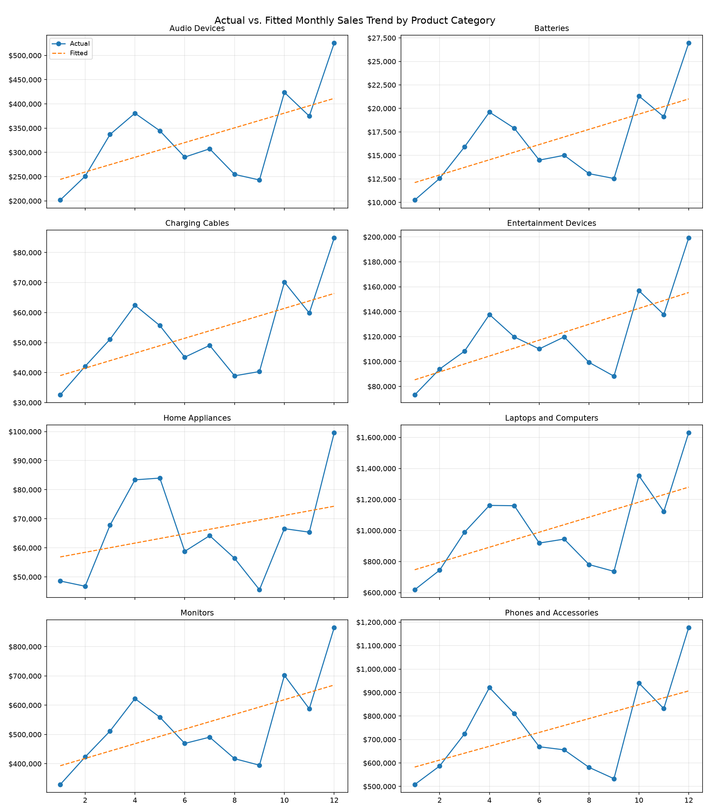
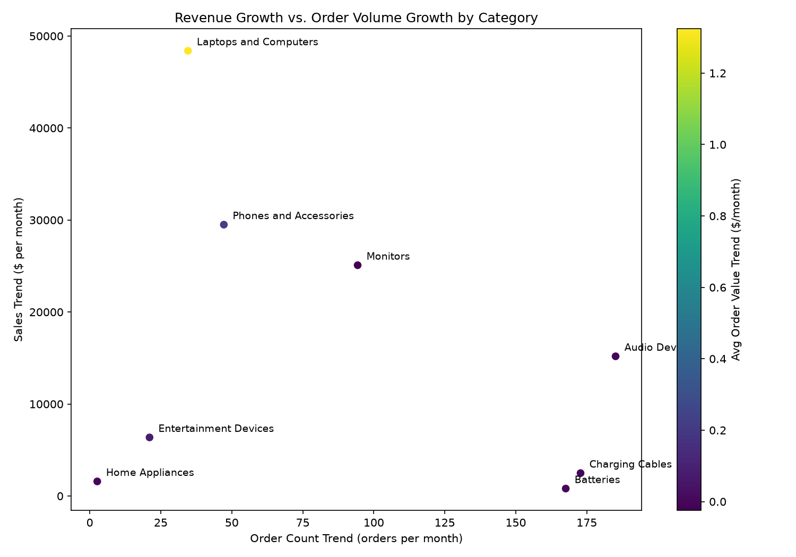
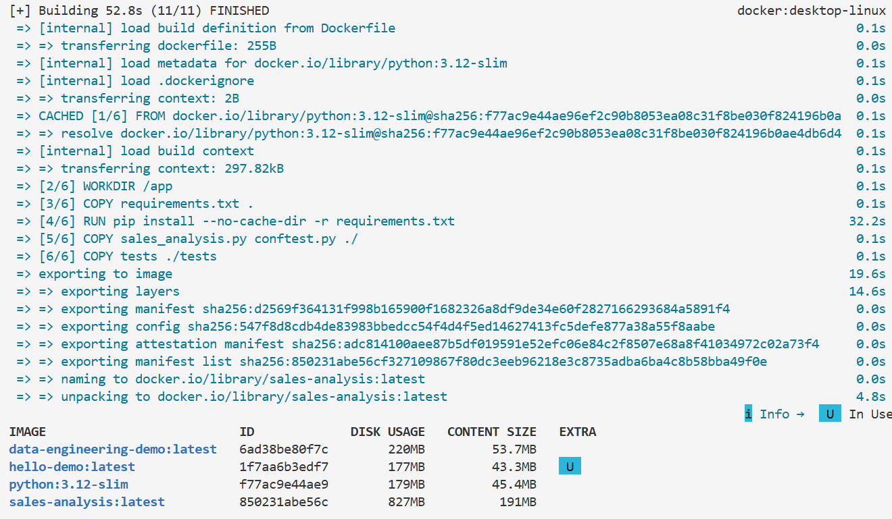
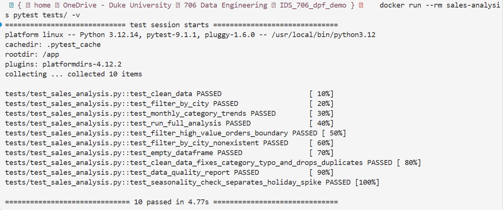

[](https://github.com/QTTN1/IDS_706_dpf_demo/actions/workflows/tests.yml)

# Which product categories are actually growing?

An analysis of one year of e-commerce electronics sales (Kaggle), built as a tested, linted, containerized Python project.

## Main Questions:

1. Which categories bring in the revenue, and which bring in just order volume?
2. Which categories are growing each month (linear trend of sales, orders, and average order value)?
3. Is that growth real, or mostly the holiday spike?

## Dataset

[Sales Dataset (E-Commerce Sales)](https://www.kaggle.com/datasets/naofilahmad/sales-datset-product-sample) from Kaggle: ~186k order line items, 8 product categories, 9 US cities, 12 months of 2019. 

## Setup

```
pip install -r requirements.txt     # Python 3.12; versions are pinned for reproducibility
python sales_analysis.py            # downloads the data, prints all results, saves plots to output/
pytest tests/ -v                    # run the tests
```

Or with Docker, no Python setup needed (see [Docker](#docker)).

`Week2_Mini_Assignment.ipynb` is the original exploratory notebook. `sales_analysis.py` is the cleaned-up, tested version.

## Project structure

```
sales_analysis.py          # all analysis code (load, quality report, clean, summarize, trend models, plots)
tests/                     # pytest tests + screenshots
conftest.py                # lets tests import sales_analysis from any directory
requirements.txt           # pinned dependencies
Dockerfile                 # container for running the analysis or tests
.flake8                    # flake8 (linting) config
.github/workflows/         # CI: black + flake8 + pytest on every push
Week2_Mini_Assignment.ipynb  # original exploration
```

## Data cleaning

`data_quality_report()` checks the **raw** data before anything is changed, and `clean_data()` applies the fixes. Running the script prints the report.

| Check                     | Result                                                                                                | Treatment                                                                                                                                                                                             |
| ------------------------- | ----------------------------------------------------------------------------------------------------- | ----------------------------------------------------------------------------------------------------------------------------------------------------------------------------------------------------- |
| Missing values            | 0                                                                                                     | None found, nothing to fill or drop.                                                                                                                                                                  |
| Exact duplicate rows      | 264                                                                                                   | Dropped, since the same line item recorded twice would double-count revenue (185,950 -> 185,686 rows). The CSV's leftover index column makes every row look unique, so it's dropped before checking. |
| Sales != Quantity x Price | 0                                                                                                     | None found, so the Sales column can be trusted.                                                                                                                                                       |
| Category renamed          | "Batterie"                                                                                            | Renamed to "Batteries" so it groups and reads correctly in charts.                                                                                                                                    |
| Order Date                | day-first strings, e.g. 30-12-2019 00:01                                                              | Parsed with an explicit format, so 05-12-2019 is 5 Dec, not 12 May.                                                                                                                                   |
| City                      | stray whitespace, e.g. " Boston"                                                                      | Stripped.                                                                                                                                                                                             |
| Sales outliers            | 7,617 rows (~4%), mostly Charging Cables (3,332), Batteries (2,153), and Phones & Accessories (2,076) | Kept. Outliers are measured within each category (1.5 x IQR), because a $1,700 laptop is normal while a $1,700 battery order is not. Removing outliers would understate revenue.                    |

## Analysis

**Revenue vs. volume.** Grouped by category: average price, total quantity, total sales, and line-item count (`category_summary`).

**Trend model.** Aggregated sales per category per month, then fit a linear regression (Sales ~ Month) per category. The slope is the average change in monthly revenue ($/month). I did the same for order count and average order value, since a category can grow in orders without growing in revenue, or vice versa.

**Visualizations** (regenerated in `output/` on every run):

- `all_categories_trend.png`: actual vs. fitted monthly sales for every category
- `trend_scatter.png`: order-count trend vs. sales trend, colored by average-order-value trend, so all three show up in one chart





### Seasonality check

The trend lines all point up, but electronics sales spike in December. A single holiday month at the end of the year can tilt a 12-point regression line upward on its own. `seasonality_check()` refits each trend **without December** and reports R^2 for both fits:

- if the slope stays positive without December, the category is really growing
- if it collapses toward 0, the "growth" was mostly the holiday rush

| Category               | Slope, all months ($/month) | Slope without December | Drop | R^2 (all / without Dec) |
| ---------------------- | --------------------------- | ---------------------- | ---- | ----------------------- |
| Laptops and Computers  | 48,393                      | 29,272                 | -40% | 0.36 / 0.19             |
| Phones and Accessories | 29,495                      | 14,779                 | -50% | 0.29 / 0.10             |
| Monitors               | 25,088                      | 14,376                 | -43% | 0.37 / 0.19             |
| Audio Devices          | 15,187                      | 8,964                  | -41% | 0.37 / 0.19             |
| Entertainment Devices  | 6,368                       | 3,976                  | -38% | 0.45 / 0.29             |
| Charging Cables        | 2,488                       | 1,478                  | -41% | 0.37 / 0.19             |
| Home Appliances        | 1,586                       | 207                    | -87% | 0.12 / 0.003            |
| Batteries              | 809                         | 485                    | -40% | 0.39 / 0.21             |

December alone accounts for about 40-50% of every category's "growth". Every category except Home Appliances still grows meaningfully  without it, so the growth is real, just smaller than the straight trend line suggests.

Key findings

- **Revenue is concentrated in expensive categories.** Laptops & Computers are ~35% of revenue from ~5% of line items; Phones add another ~26%.
- **Volume doesn't equal revenue.** Batteries, Charging Cables, and Audio Devices are ~71% of line items but only ~14% of revenue.
- **Every category trended up**, led by Laptops & Computers (~$48.4k/month), then Phones (~$29.5k/month) and Monitors (~$25.1k/month).
- **Laptops are growing in value, not just volume.** Their average order value trend is the highest (~+$1.32/month), while cheaper accessories grow in order count with flat order value.
- **About 40-50% of the "growth" is just December.** Without the holiday month, every category still grows except Home Appliances, which is flat. Phones lose the most (-50%), so their growth depends the most on the holidays.

Testing & CI

I had to move the notebook's process into `sales_analysis.py` and break it down again, into functions, before I could test it.

Tests are in `tests/test_sales_analysis.py`, built with small made-up data (pytest fixtures) instead of the real dataset, so they run fast and don't need my Kaggle login or internet to work.

**Main test cases**

- `clean_data`: drops the extra index column, parses Order Date as a real date (day-first, e.g. `15-01-2019` = Jan 15), strips whitespace from City
- `filter_by_city`: returns only the requested city
- `monthly_category_trends`: slopes match hand-calculated values (+$500/month, -$100/month), sorted fastest-growing first
- `run_full_analysis`: whole pipeline from a CSV file, to check everything still connects correctly
- `clean_data` fixes the `"Batterie"` typo and drops exact duplicate rows
- `data_quality_report`: counts missing values, duplicates, Sales/price mismatches, and per-category outliers on a small "messy" dataset with exactly one of each problem
- `seasonality_check`: flat sales plus a December spike looks like growth, but the slope without December is ~0

**Edge cases**

- **Exactly $500:** `filter_high_value_orders` uses `Sales > 500`, so a $500.00 order is excluded and $500.01 is kept
- **City not in the data:** filtering for a city that doesn't exist returns an empty table (same columns) instead of an error
- **Empty dataset:** zero rows flow through cleaning, the summary, and both trend functions without crashing

The empty-dataset test found a bug: both trend functions crashed with a `KeyError` on empty input, because they tried to sort by a column that was never created. Fixed by always giving the results table its column names.

Run tests with:

```
pytest tests/ -v
```

Tests passing locally (screenshot taken at 7 tests, before the data-quality and seasonality tests were added; there are 10 now):


**GitHub Actions** (`.github/workflows/tests.yml`) runs on every push and pull request to main:

1. installs `requirements.txt`
2. checks formatting with `black --check` (fails if code isn't formatted)
3. lints with `flake8` (config in `.flake8`)
4. runs the tests with pytest

To format and lint locally before pushing: `black sales_analysis.py conftest.py tests/` and `flake8 sales_analysis.py conftest.py tests/`

Passing on GitHub:


## Docker

The `Dockerfile` packages the code, tests, and pinned dependencies (`requirements.txt`) on top of `python:3.12-slim`, so the analysis runs the same on any machine with Docker -- no Python or conda setup needed.

```bash
docker build -t sales-analysis .                                  # build the image
docker run --rm -v "$PWD/output:/app/output" sales-analysis       # run the analysis, plots saved to ./output
docker run --rm sales-analysis pytest tests/ -v                   # run the tests inside the container
```

(In Git Bash on Windows, use `MSYS_NO_PATHCONV=1 docker run --rm -v "$(pwd -W)/output:/app/output" sales-analysis` so Git Bash doesn't rewrite the paths.)

The dataset is public, so the container downloads it from Kaggle without loging in.

**What I learned**

- An *image* is the saved recipe (OS + Python + packages + code); a *container* is one run of it. Containers stop when their command finishes (`docker ps` vs `docker ps -a`).
- Copying `requirements.txt` and installing packages *before* copying the code means code edits don't trigger a reinstall -- rebuilds went from.
- Files a container writes stay inside it unless you mount a volume (`-v`), which is why plots are saved to `output/`.
- Pinning package versions to requirments matters: unpinned `pandas` would install whatever is newest on the day the image is built.

Image build:



Container running the tests and the analysis:



## Refactoring

**What I changed**

- **Removed duplicated code:** the "group by category and month, then fit a regression per category" logic was copied three times (`monthly_category_trends`, `monthly_category_trends_extended`, `plot_category_trend_grid`). I added two helpers: `_monthly_by_category()` (aggregation) and `_fit_line()` (fit + slope + R^2 + fitted values). The new `seasonality_check()` reuses both instead of making a fourth copy.
- **Clarified var names:** `t_quantity`/`t_sales` -> `total_quantity`/`total_sales`
- **Named the date format:** `DATE_FORMAT` at the top of the file, with a comment on why it's day-first
- **Structure and docs:** grouped the file into sections (loading/cleaning, summaries, trend models, plots, pipeline), fixed docstring typos, and added comments that explain *why* (e.g. why outliers are kept).
- **Tooling:** formatted with `black` and linted with `flake8`, both run in CI.

**Why:** with the loop copied three times, any change (like the empty-data crash fix) had to be made in three places. Now there's only one place to change and test.

**How I verified it still works:** all 7 existing tests pass with the refactored code, 3 new tests cover the new functions, the full pipeline re-runs in Docker, and CI (black + flake8 + pytest) passes on GitHub.

Before/after diff on GitHub:


## Also in this repo

(Not relevant to sales analysis portion)

`rust_vs_python_intro.ipynb` (Rust ownership practice)

`movielens_dataframe_engines_simple.ipynb` (data engineering walkthrough)

Note: Refactor, because even good code needs a spa day 🛁 !
